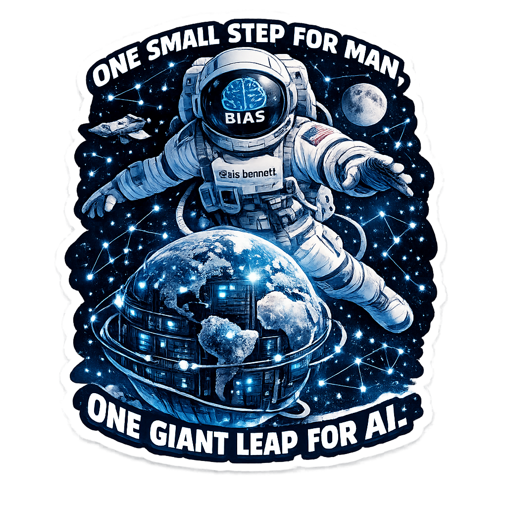
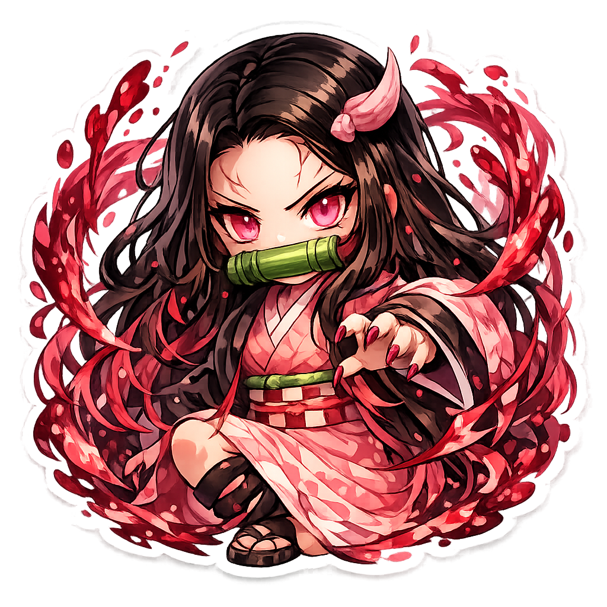
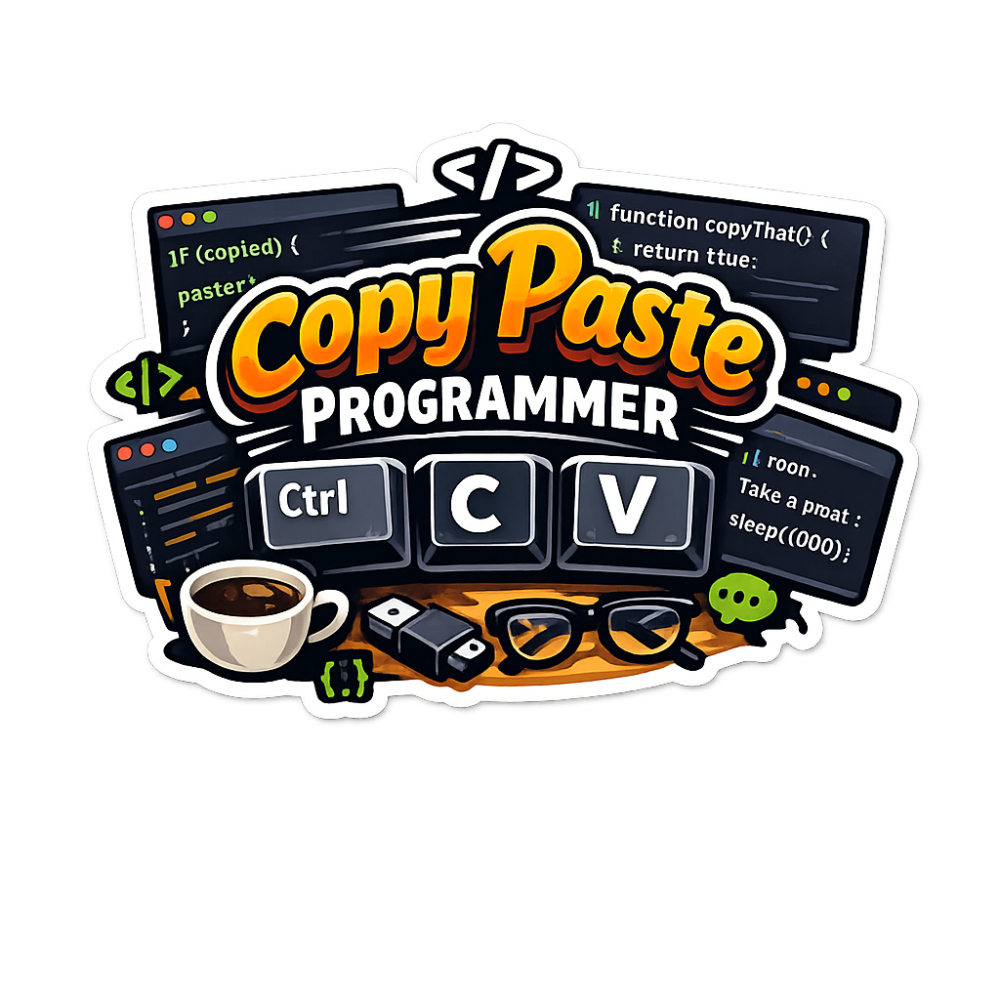
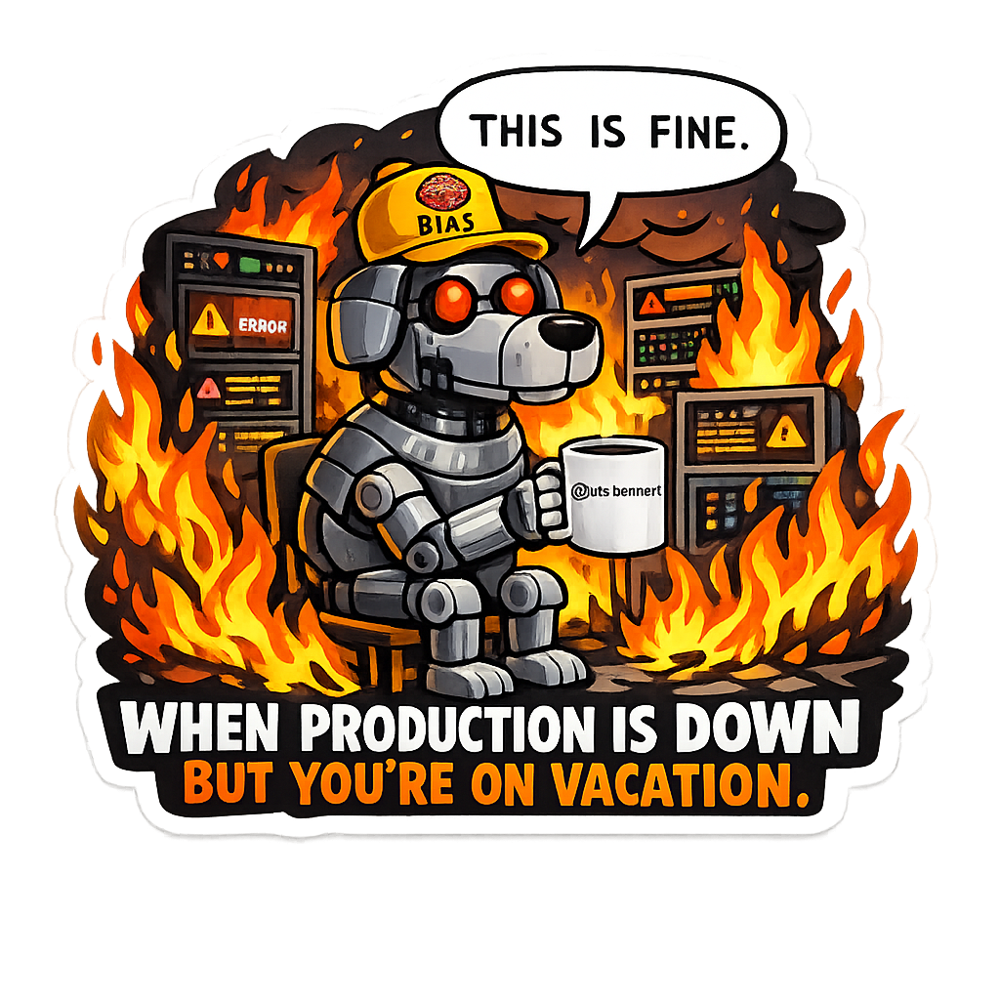
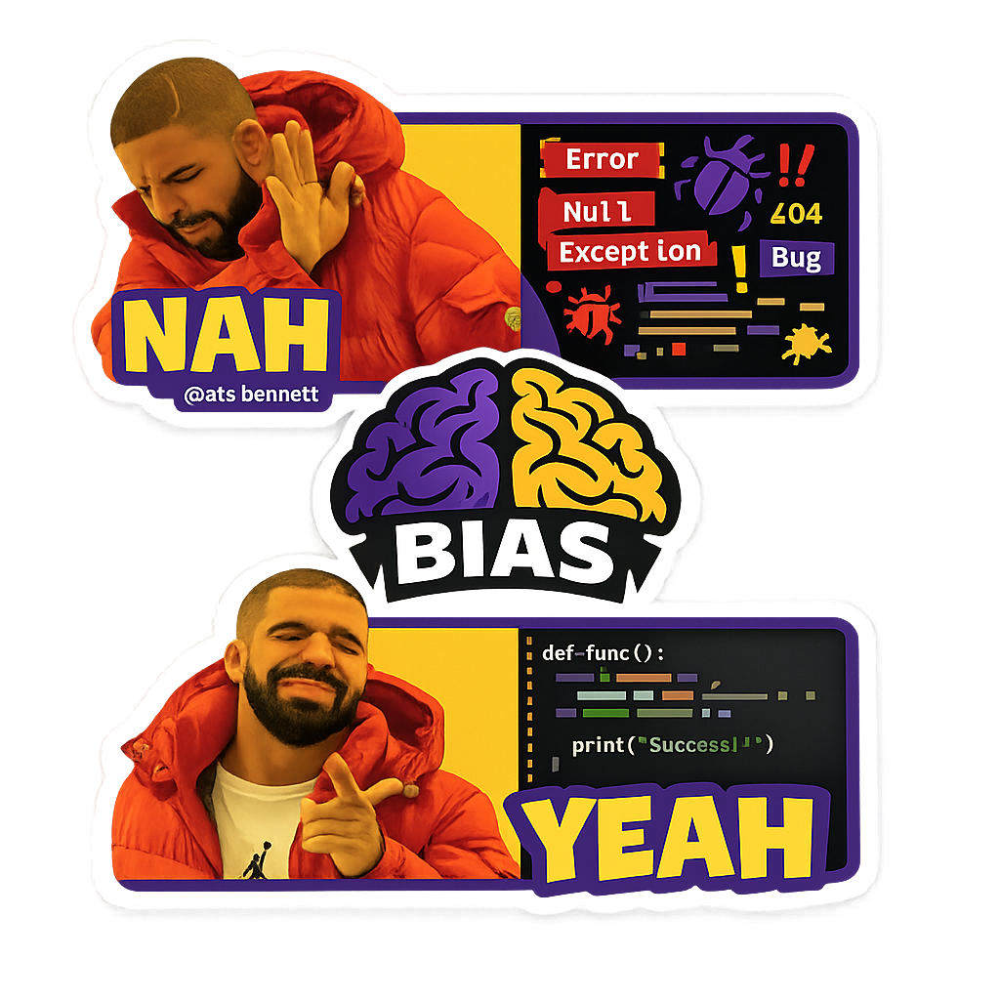
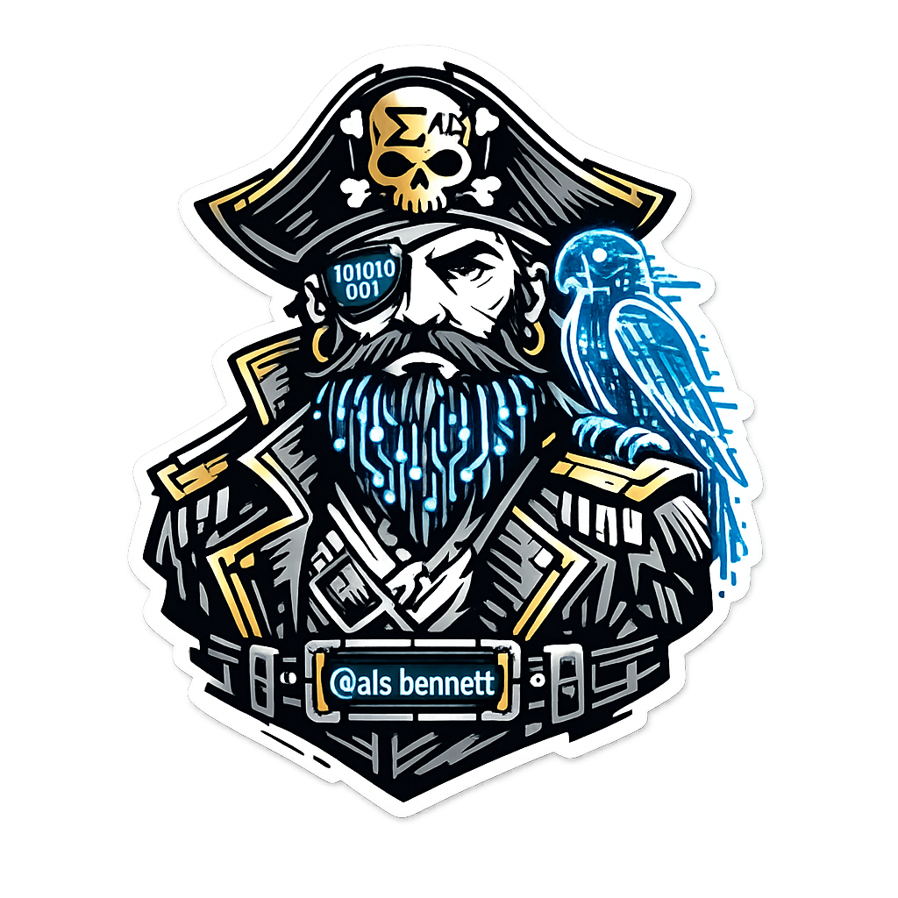
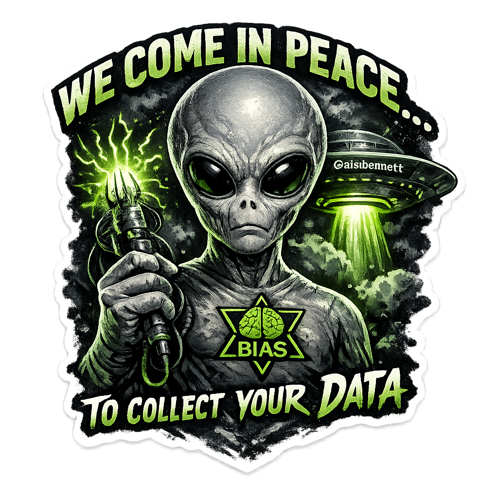
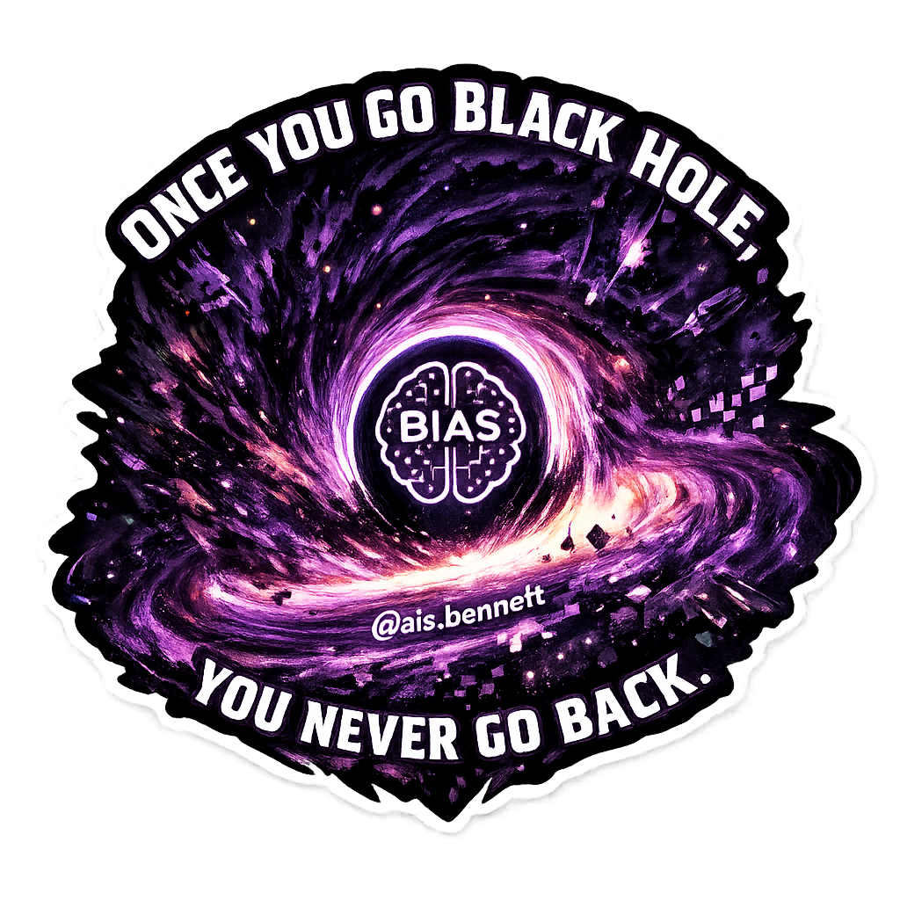

<p align="center">
  
  
  
</p>

<h1 align="center">🎨 Open Source Sticker Pack</h1>

<p align="center">
  <strong>A massive collection of high-quality stickers for developers, anime fans, and creative souls!</strong>
</p>

<p align="center">
  
  
  
</p>

<p align="center">
  <a href="#-quick-start">Quick Start</a> •
  <a href="#-sticker-directory">Directory</a> •
  <a href="#-samples">Samples</a> •
  <a href="#-how-to-use">How to Use</a> •
  <a href="#-contributing">Contributing</a>
</p>

---

## 🚀 Quick Start

Clone the repository and start using stickers right away!

```bash
git clone https://github.com/Gyaanendra/open-stickers.git
```

## 📁 Sticker Directory

Find exactly what you're looking for! Each category contains unique, high-quality stickers.

### 🤖 Tech & Programming

| Category | Description | Count |
|----------|-------------|-------|
| [**ai_ml/**](./ai_ml) | Neural networks, ML algorithms, transformers, deep learning | 50+ |
| [**data_science/**](./data_science) | Charts, pipelines, analytics, databases | 10+ |
| [**robotics/**](./robotics) | Robotic arms, drones, sensors, SLAM | 15+ |
| [**tech_memes/**](./tech_memes) | Works on my machine, CSS jokes, debugging humor | 30+ |

### 🎌 Anime & Characters

| Category | Description | Count |
|----------|-------------|-------|
| [**anime/**](./anime) | Demon Slayer, JJK, Naruto, Bleach, AOT, Chainsaw Man, and more! | 150+ |
| [**anime_general/**](./anime_general) | General anime art and characters | 20+ |

### 🎬 Entertainment

| Category | Description | Count |
|----------|-------------|-------|
| [**movies/**](./movies) | Inception, Interstellar, Dune, John Wick | 10+ |
| [**cinema/**](./cinema) | Classic cinema themed stickers | 10+ |
| [**tv_shows/**](./tv_shows) | Popular TV show characters and references | 20+ |
| [**ai_movies/**](./ai_movies) | AI in movies themed stickers | 10+ |

### 🎭 Memes & Fun

| Category | Description | Count |
|----------|-------------|-------|
| [**memes/**](./memes) | Distracted boyfriend, Drake, This is Fine, Stonks, and more! | 15+ |
| [**retro_fun/**](./retro_fun) | Retro and vintage styled fun stickers | 10+ |

### 🌟 Themes

| Category | Description | Count |
|----------|-------------|-------|
| [**pirate_theme/**](./pirate_theme) | Cyber pirates, code ships, treasure, jolly roger | 15+ |
| [**space_scifi/**](./space_scifi) | Astronauts, aliens, black holes, Mars, space stations | 10+ |
| [**futuristic/**](./futuristic) | Futuristic and cyberpunk styled stickers | 10+ |
| [**dinosaurs/**](./dinosaurs) | Prehistoric creatures with a twist | 10+ |

### 🐾 Special Collections

| Category | Description | Count |
|----------|-------------|-------|
| [**ai_animals/**](./ai_animals) | AI-generated animal stickers | 10+ |
| [**ai_religious/**](./ai_religious) | Spiritual and religious themed AI art | 10+ |
| [**other/**](./other) | Miscellaneous cool stickers | 20+ |

---

## 🖼️ Samples

### Anime Collection 
*From Demon Slayer to Jujutsu Kaisen - we've got your favorites!*

<p align="center">
  
  
  
  
  
</p>

### AI/ML Collection
*Perfect for data scientists and ML engineers!*

<p align="center">
  
  
  
  
</p>

### Tech Memes
*Because debugging is 90% of our lives!*

<p align="center">
  
  
  
  
</p>

### Memes Collection
*Classic memes as stickers!*

<p align="center">
  
  
  
</p>

### Pirate Theme
*Ahoy! Perfect for your next hackathon!*

<p align="center">
  
  
  
</p>

### Space & Sci-Fi
*For the space enthusiasts!*

<p align="center">
  
  
  
</p>

---

## 💡 How to Use

### Download Individual Stickers
Navigate to any category folder and download the PNG file you want!

### Use in Projects
```markdown

```

### Print Your Own
All stickers are high-resolution PNGs - perfect for printing!

### Use in Chat Apps
Import into Telegram, Discord, Slack, or any platform that supports custom stickers!

---

## 📊 Stats

```
📁 Total Categories: 18
🎨 Total Stickers: 1000+
📐 Resolution: High-Quality PNG
🎯 Format: Transparent Background
```

---

## 🤝 Contributing

Love stickers? Want to add more? PRs are welcome!

1. Fork the repository
2. Add your stickers to the appropriate category
3. Update the README if needed
4. Submit a pull request!

### Guidelines
- ✅ High-quality PNG with transparent background
- ✅ Appropriate for all audiences  
- ✅ Original content or properly licensed
- ✅ Consistent with category theme

---

## 📜 License

This sticker pack is **open source** and free to use in personal and commercial projects.

---

<p align="center">
  <strong>⭐ Star this repo if you find it useful! ⭐</strong>
</p>

<p align="center">
  Made with ❤️ by the community
</p>
